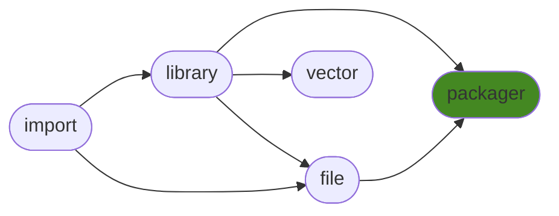

# ManderaGeneral
 - Modularized platform for managing future products.
 - Automatic workflows to unittest, sync and publish.

## Dependency Diagram for ManderaGeneral

## Information
| Package                                                              | Ver                                                | Latest Release        | Python                                                                                                                                                                                  | Platform        | Cover   |
|:---------------------------------------------------------------------|:---------------------------------------------------|:----------------------|:----------------------------------------------------------------------------------------------------------------------------------------------------------------------------------------|:----------------|:--------|
| [generalfile](https://github.com/ManderaGeneral/generalfile)         | [2.5.12](https://pypi.org/project/generalfile/)    | 2022-10-19 16:24 CEST | [3.8](https://www.python.org/downloads/release/python-380/), [3.9](https://www.python.org/downloads/release/python-390/), [3.10](https://www.python.org/downloads/release/python-3100/) | Windows, Ubuntu | ❌      |
| [generalimport](https://github.com/ManderaGeneral/generalimport)     | [0.3](https://pypi.org/project/generalimport/)     | 2022-10-19 16:23 CEST | [3.8](https://www.python.org/downloads/release/python-380/), [3.9](https://www.python.org/downloads/release/python-390/), [3.10](https://www.python.org/downloads/release/python-3100/) | Windows, Ubuntu | ❌      |
| [generallibrary](https://github.com/ManderaGeneral/generallibrary)   | [2.9.10](https://pypi.org/project/generallibrary/) | 2022-10-19 16:23 CEST | [3.8](https://www.python.org/downloads/release/python-380/), [3.9](https://www.python.org/downloads/release/python-390/), [3.10](https://www.python.org/downloads/release/python-3100/) | Windows, Ubuntu | ❌      |
| [generalpackager](https://github.com/ManderaGeneral/generalpackager) | [0.5.5](https://pypi.org/project/generalpackager/) | 2022-10-19 16:24 CEST | [3.8](https://www.python.org/downloads/release/python-380/), [3.9](https://www.python.org/downloads/release/python-390/), [3.10](https://www.python.org/downloads/release/python-3100/) | Windows, Ubuntu | ❌      |
| [generalvector](https://github.com/ManderaGeneral/generalvector)     | [1.5.17](https://pypi.org/project/generalvector/)  | 2022-10-19 16:24 CEST | [3.8](https://www.python.org/downloads/release/python-380/), [3.9](https://www.python.org/downloads/release/python-390/), [3.10](https://www.python.org/downloads/release/python-3100/) | Windows, Ubuntu | ❌      |

## Contributions
Issue-creation and discussions are most welcome!

Pull requests are not wanted, please discuss with me before investing any time

Generated 2022-10-24 16:29 CEST

