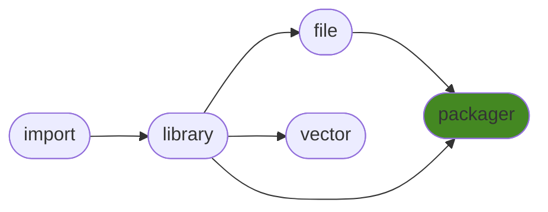

# generalpackager
Tools to interface GitHub, PyPI, NPM and local modules / repos. Used for generating files to keep projects dry and synced. Tailored for my general packages.

## Contents
<pre>
<a href='#generalpackager'>generalpackager</a>
├─ <a href='#Dependency-Tree'>Dependency Tree</a>
├─ <a href='#Installation'>Installation</a>
├─ <a href='#Information'>Information</a>
├─ <a href='#Attributes'>Attributes</a>
├─ <a href='#Contributions'>Contributions</a>
└─ <a href='#Todo'>Todo</a>
</pre>

## Dependency Tree

## Installation
| `pip install`                                                                      | `generalpackager`   |
|:-----------------------------------------------------------------------------------|:--------------------|
| <a href='https://pypi.org/project/generallibrary[table]'>generallibrary[table]</a> | ✔️                  |
| <a href='https://pypi.org/project/generalfile'>generalfile</a>                     | ✔️                  |
| <a href='https://pypi.org/project/gitpython'>gitpython</a>                         | ✔️                  |
| <a href='https://pypi.org/project/pygithub'>pygithub</a>                           | ✔️                  |
| <a href='https://pypi.org/project/requests'>requests</a>                           | ✔️                  |
| <a href='https://pypi.org/project/pyinstaller'>pyinstaller</a>                     | ✔️                  |
| <a href='https://pypi.org/project/coverage'>coverage</a>                           | ✔️                  |

## Information
| Package                                                              | Ver                                                | Latest Release        | Python                                                                                                                                                                                  | Platform        |   Lvl | Todo                                                         | Cover   |
|:---------------------------------------------------------------------|:---------------------------------------------------|:----------------------|:----------------------------------------------------------------------------------------------------------------------------------------------------------------------------------------|:----------------|------:|:-------------------------------------------------------------|:--------|
| [generalpackager](https://github.com/ManderaGeneral/generalpackager) | [0.5.3](https://pypi.org/project/generalpackager/) | 2022-09-09 12:44 CEST | [3.8](https://www.python.org/downloads/release/python-380/), [3.9](https://www.python.org/downloads/release/python-390/), [3.10](https://www.python.org/downloads/release/python-3100/) | Windows, Ubuntu |     3 | [16](https://github.com/ManderaGeneral/generalpackager#Todo) | 67.0 %  |

## Attributes
<pre>
<a href='https://github.com/ManderaGeneral/generalpackager/blob/master/generalpackager/__init__.py#L1'>Module: generalpackager</a>
├─ <a href='https://github.com/ManderaGeneral/generalpackager/blob/master/generalpackager/api/github.py#L12'>Class: GitHub</a>
├─ <a href='https://github.com/ManderaGeneral/generalpackager/blob/master/generalpackager/api/localmodule.py#L8'>Class: LocalModule</a>
├─ <a href='https://github.com/ManderaGeneral/generalpackager/blob/master/generalpackager/api/localrepo/base/localrepo.py#L15'>Class: LocalRepo</a>
├─ <a href='https://github.com/ManderaGeneral/generalpackager/blob/master/generalpackager/api/localrepo/node/localrepo_node.py#L6'>Class: LocalRepo_Node</a>
├─ <a href='https://github.com/ManderaGeneral/generalpackager/blob/master/generalpackager/api/localrepo/python/localrepo_python.py#L11'>Class: LocalRepo_Python</a>
├─ <a href='https://github.com/ManderaGeneral/generalpackager/blob/master/generalpackager/packager.py#L17'>Class: Packager</a>
└─ <a href='https://github.com/ManderaGeneral/generalpackager/blob/master/generalpackager/api/pypi.py#L26'>Class: PyPI</a>
</pre>

## Contributions
Issue-creation and discussions are most welcome!

Pull requests are not wanted, please discuss with me before investing any time

## Todo
| Module                                                                                                                                                      | Message                                                                                                                                                                                                          |
|:------------------------------------------------------------------------------------------------------------------------------------------------------------|:-----------------------------------------------------------------------------------------------------------------------------------------------------------------------------------------------------------------|
| <a href='https://github.com/ManderaGeneral/generalpackager/blob/master/generalpackager/api/pypi.py#L1'>pypi.py</a>                                          | <a href='https://github.com/ManderaGeneral/generalpackager/blob/master/generalpackager/api/pypi.py#L12'>Move download to it's own package.</a>                                                                   |
| <a href='https://github.com/ManderaGeneral/generalpackager/blob/master/generalpackager/api/pypi.py#L1'>pypi.py</a>                                          | <a href='https://github.com/ManderaGeneral/generalpackager/blob/master/generalpackager/api/pypi.py#L66'>Find a faster fetch for latest PyPI version and datetime.</a>                                            |
| <a href='https://github.com/ManderaGeneral/generalpackager/blob/master/generalpackager/api/github.py#L1'>github.py</a>                                      | <a href='https://github.com/ManderaGeneral/generalpackager/blob/master/generalpackager/api/github.py#L14'>Get and Set GitHub repo private.</a>                                                                   |
| <a href='https://github.com/ManderaGeneral/generalpackager/blob/master/generalpackager/api/localrepo/python/metadata_python.py#L1'>metadata_python.py</a>   | <a href='https://github.com/ManderaGeneral/generalpackager/blob/master/generalpackager/api/localrepo/python/metadata_python.py#L4'>Dynamic values in DataClass to remove LocalRepos and Metadatas.</a>           |
| <a href='https://github.com/ManderaGeneral/generalpackager/blob/master/generalpackager/api/localrepo/python/localrepo_python.py#L1'>localrepo_python.py</a> | <a href='https://github.com/ManderaGeneral/generalpackager/blob/master/generalpackager/api/localrepo/python/localrepo_python.py#L65'>Make sure twine is installed when trying to upload to pypi.</a>             |
| <a href='https://github.com/ManderaGeneral/generalpackager/blob/master/generalpackager/api/localrepo/python/localrepo_python.py#L1'>localrepo_python.py</a> | <a href='https://github.com/ManderaGeneral/generalpackager/blob/master/generalpackager/api/localrepo/python/localrepo_python.py#L66'>Look into private PyPI server where we could also do dry runs for test.</a> |
| <a href='https://github.com/ManderaGeneral/generalpackager/blob/master/generalpackager/api/localrepo/base/localrepo.py#L1'>localrepo.py</a>                 | <a href='https://github.com/ManderaGeneral/generalpackager/blob/master/generalpackager/api/localrepo/base/localrepo.py#L20'>Search for imports to list dependencies.</a>                                         |
| <a href='https://github.com/ManderaGeneral/generalpackager/blob/master/generalpackager/packager_workflow.py#L1'>packager_workflow.py</a>                    | <a href='https://github.com/ManderaGeneral/generalpackager/blob/master/generalpackager/packager_workflow.py#L195'>Add single job to make sure workflow is up to date.</a>                                        |
| <a href='https://github.com/ManderaGeneral/generalpackager/blob/master/generalpackager/packager_files.py#L1'>packager_files.py</a>                          | <a href='https://github.com/ManderaGeneral/generalpackager/blob/master/generalpackager/packager_files.py#L44'>Watermark generated files to prevent mistake of thinking you can modify them directly.</a>         |
| <a href='https://github.com/ManderaGeneral/generalpackager/blob/master/generalpackager/packager_files.py#L1'>packager_files.py</a>                          | <a href='https://github.com/ManderaGeneral/generalpackager/blob/master/generalpackager/packager_files.py#L102'>Generalize get_new_packager which calls recycle_clear on all attributes.</a>                      |
| <a href='https://github.com/ManderaGeneral/generalpackager/blob/master/generalpackager/packager_files.py#L1'>packager_files.py</a>                          | <a href='https://github.com/ManderaGeneral/generalpackager/blob/master/generalpackager/packager_files.py#L115'>Fix create_blank, it overwrites current projects pip install.</a>                                 |
| <a href='https://github.com/ManderaGeneral/generalpackager/blob/master/generalpackager/other/packages.py#L1'>packages.py</a>                                | <a href='https://github.com/ManderaGeneral/generalpackager/blob/master/generalpackager/other/packages.py#L11'>Generate Python file in generalpackager containing general packages.</a>                           |
| <a href='https://github.com/ManderaGeneral/generalpackager/blob/master/generalpackager/packager_github.py#L1'>packager_github.py</a>                        | <a href='https://github.com/ManderaGeneral/generalpackager/blob/master/generalpackager/packager_github.py#L32'>commit-hook failed for auto commit "not a valid Win32 application</a>                             |
| <a href='https://github.com/ManderaGeneral/generalpackager/blob/master/generalpackager/packager_github.py#L1'>packager_github.py</a>                        | <a href='https://github.com/ManderaGeneral/generalpackager/blob/master/generalpackager/packager_github.py#L41'>Fetch commit sha locally before pushing, possibly generate sha before commit.</a>                 |
| <a href='https://github.com/ManderaGeneral/generalpackager/blob/master/generalpackager/packager_github.py#L1'>packager_github.py</a>                        | <a href='https://github.com/ManderaGeneral/generalpackager/blob/master/generalpackager/packager_github.py#L79'>Setup env vars for project.</a>                                                                   |
| <a href='https://github.com/ManderaGeneral/generalpackager/blob/master/generalpackager/packager_markdown.py#L1'>packager_markdown.py</a>                    | <a href='https://github.com/ManderaGeneral/generalpackager/blob/master/generalpackager/packager_markdown.py#L70'>Sort todos by name to decrease automatic commit changes.</a>                                    |

Generated 2022-09-27 05:21 CEST for commit <a href='https://github.com/ManderaGeneral/generalpackager/commit/master'>master</a>.

